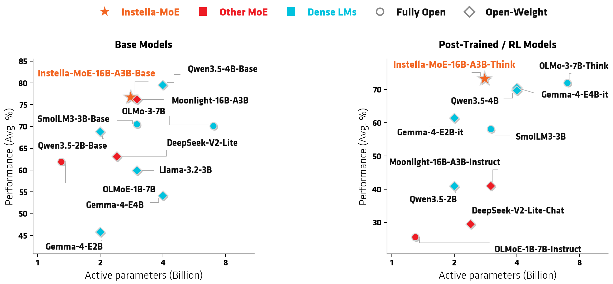
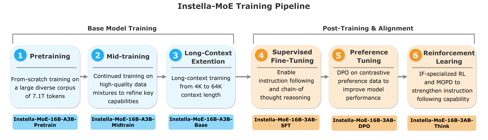

<div align="center">
  <br>
  <br>

  <h1>Instella-MoE✨: Fully Open State-of-the-Art Mixture-of-Experts Language Model</h1>
<a href='https://huggingface.co/collections/amd/instella-moe'></a>
<a href='https://rocm.blogs.amd.com/artificial-intelligence/instella-moe/README.html'></a> 

</div>

Instella-MoE is a state-of-the-art fully open Mixture-of-Experts (MoE) language model with 16 billion total parameters and 2.8 billion active parameters trained end-to-end from pre-training to RL. 
Trained from scratch on AMD Instinct™ MI300X and MI325X GPUs using AMD's [Primus](https://github.com/AMD-AGI/Primus) framework, Instella-MoE combines a sparsely activated MoE design with architectural innovations such as Gated Multi-head Latent Attention (Gated MLA) and [FarSkip-Collective](https://github.com/AMD-AGI/FarSkip-Collective). 

<div align="center">

<em><b>Figure 1:</b> Pre-trained and Post-trained Instella-MoE model performance compared with other similarly sized state-of-the-art models. </em>
</div>


### Getting Started
To run training of Instella-MoE on AMD hardware use the `rocm/megatron-lm:v25.8_py310` docker image. which can be started via
```bash
IMAGE_NAME=rocm/megatron-lm:v25.8_py310
docker run \
    -it \
    --rm \
    --network=host \
    --ipc=host \
    --privileged \
    --device=/dev/kfd \
    --device=/dev/dri \
    --device=/dev/infiniband \
    --group-add video \
    --cap-add=SYS_PTRACE \
    --security-opt seccomp=unconfined \
    --shm-size 200G \
    -v $HOME:$HOME \
    --name 'instella_moe_train' \
    $IMAGE_NAME \
    /bin/bash
```

To test training with mock data, inside the docker run 
```bash
git clone https://github.com/AMD-AGI/Instella-MoE.git
cd Instella-MoE/training
git submodule update --init --recursive
EXP=examples/megatron/configs_instella_moe/instella_moe-mock_pretrain.yaml \
    bash examples/run_instella.sh --task pretrain
```

### Example Usage
```python
from transformers import AutoModelForCausalLM, AutoTokenizer
checkpoint = "amd/Instella-MoE-16B-A3B-Think"

tokenizer = AutoTokenizer.from_pretrained(checkpoint, trust_remote_code=True)
model = AutoModelForCausalLM.from_pretrained(checkpoint, device_map="auto", trust_remote_code=True)

prompt = [{"role": "user", "content": "What are the computational benefits of Mixture-of-Experts models?"}]
inputs = tokenizer.apply_chat_template(
    prompt,
    add_generation_prompt=True,
    return_tensors='pt'
)

tokens = model.generate(
    inputs.to(model.device),
    max_new_tokens=1024,
    temperature=0.6,
    top_p=0.95,
    do_sample=True
)

print(tokenizer.decode(tokens[0], skip_special_tokens=False))
```


## Training
Below we provide stage-by-stage descriptions, training configs, and launch scripts to reproduce Instella-MoE training.
<div align="center">

</div>


The pre-training through DPO stages are run based on [Primus](https://github.com/AMD-AGI/Primus/tree/dev/farskip) under `training/` with the unified `examples/run_instella.sh` script (run from the `training/` directory). Each stage is selected via the `--task` flag, and the stage configuration is passed via the `EXP` environment variable. 

The reinforcement learning stage is run separately under `rl/`, which is built on [`Miles`](https://github.com/radixark/miles) and reuses our `training/` and `inference/` backends. See [`rl/README.md`](rl/README.md) for its detailed setup and launch instructions.


The stages below follow the full training pipeline in order, with each stage resuming from the checkpoint of the previous stage.

### Pre-training
The Pre-training stage starts from scratch and trains on 7.1T high-quality, diverse training tokens.
```bash
cd training
EXP=examples/megatron/configs_instella_moe/instella_moe-pretrain.yaml \
    bash examples/run_instella.sh --task pretrain
```

### Mid-training
Mid-training resumes from the pre-training checkpoint, for which we train with 3 data variants to produce 3 distinct checkpoints (`midtrain_v1`, `midtrain_v2`, `midtrain_v3`).
```bash
EXP=examples/megatron/configs_instella_moe/instella_moe-midtrain_v1.yaml \
    bash examples/run_instella.sh --task pretrain
```
#### Mid-training merging
After training the mid-training model variants, we produce the final mid-training checkpoint by merging (weight-averaging) the Hugging Face checkpoints of the variants.
Use [merge_hf_ckpts.py](training/examples/scripts/instella_moe_process_checkpoint/merge_hf_ckpts.py):
```bash
python training/examples/scripts/instella_moe_process_checkpoint/merge_hf_ckpts.py \
    --model_class AutoModelForCausalLM \
    --out_dir /path/to/midtrain_merged \
    --checkpoints /path/to/midtrain_v1 /path/to/midtrain_v2 /path/to/midtrain_v3 \
    --weights 1.0 1.0 1.0 \
    --dtype float32 \
    --save_safetensors \
    --trust_remote_code \
    --copy_tokenizer
```
We share additional details about checkpoint processing [here](training/examples/scripts/instella_moe_process_checkpoint/README.md).
### Long-context training
In the Long-context training stage we extend Instella-MoE to long-context documents via training at 64k context length. 
This stage resumes from the mid-training merged checkpoint. We modify the model configuration and extend the RoPE theta parameter to support longer contexts. 
We run the Long-context training in two phases each at the same context length.
The first phase teaches the model to attend to information across the full 64K window using a long-context general mixture.
The second phase further sharpens long-context performance on math, code, and reasoning-heavy tasks.

```bash
# Phase 1
EXP=examples/megatron/configs_instella_moe/instella_moe-long_ctx_phase1.yaml \
    bash examples/run_instella.sh --task docmask

# Phase 2
EXP=examples/megatron/configs_instella_moe/instella_moe-long_ctx_phase2.yaml \
    bash examples/run_instella.sh --task docmask
```
The phase-2 long-context checkpoint serves as our "Base" Instella-MoE checkpoint.

### Supervised Fine-Tuning (SFT)
Supervised Fine-Tuning resumes from the long-context phase-2 checkpoint and trains on the SFT data mixture defined in the config's `sft_config` block.
We also split the SFT curriculum into two continuous phases: Phase 1 trains on the general SFT mixture, and Phase 2 anneals onto a curated mix at the final phase of training.
This phase-2 mix is a feedback-driven set of 512K samples selected to target the phase-1 checkpoint's weaknesses, sharpening model capabilities.

```bash
# Phase 1: general SFT mixture
EXP=examples/megatron/configs_instella_moe/instella_moe-sft_phase1.yaml \
    bash examples/run_instella.sh --task sft

# Phase 2: feedback-driven curated mixture (auto-resumes from phase 1)
EXP=examples/megatron/configs_instella_moe/instella_moe-sft_phase2.yaml \
    bash examples/run_instella.sh --task sft
```

### Direct Preference Optimization (DPO)
Direct Preference Optimization resumes from the final SFT checkpoint and runs in two stages. 
Stage 1 computes and caches the reference log-probs with a forward-only pass; stage 2 runs the actual DPO training using the reference model log-probability cache.
During this stage we disable the router bias updates and the auxiliary load-balancing loss, as we found it improved DPO training performance while not harming expert load balance.
```bash
# Stage 1: compute reference log-probs
EXP=examples/megatron/configs_instella_moe/instella_moe-dpo.yaml \
    bash examples/run_instella.sh --task dpo --compute-ref-logprobs

# Stage 2: DPO training
EXP=examples/megatron/configs_instella_moe/instella_moe-dpo.yaml \
    bash examples/run_instella.sh --task dpo
```

### RL-training
We use the final DPO checkpoint as the base policy for our RL training.
The RL stage is implemented in `rl/`, which builds on `miles` for orchestration and reuses our `training/` and `inference/` backends.
The RL environment shares the same docker image as the SGLang inference engine, which is compatible with both the `training/` and `inference/` backends.
See [`rl/README.md`](rl/README.md) for the detailed setup and launch instructions.

#### Instruction-Following RL (IF-RL)
We first run RL on Instruction-Following tasks (IF-RL) to create an IF expert.
After setup, IF-RL training can be run via
```bash
cd rl
bash examples/if_rl/run_rl_instella_if_thinkrl.sh 
```

#### Multi-teacher On-Policy Distillation (MOPD)
The IF expert improves instruction following but regresses on other fields such as mathematical reasoning.
To mitigate this, we employ Multi-teacher On-Policy Distillation ([MOPD](https://arxiv.org/abs/2606.30406)), which anchors the model to both the IF expert trained with RL and the initial policy produced after DPO.
After setup, MOPD can be run with
```bash
# 1. Build the domain-tagged mixed prompt set
python examples/mopd/prepare_rl_dolci.py --if-frac 0.5 ...   # -> opd_mixed_prompts.jsonl

# 2. Serve the two teachers (one serving deployment each)
# on host1
MODEL=/path/to/if_rl_teacher_hf bash examples/mopd/serve_teacher.sh
# on host2 
MODEL=/path/to/dpo_teacher_hf bash examples/mopd/serve_teacher.sh

# 3. Launch MOPD (Ray cluster must already be up)
bash examples/mopd/run_rl_instella_mopd.sh
```

The output of MOPD training serves as the final Instella-MoE checkpoint: Instella-MoE-16B-A3B-Think.
Instella-MoE-16B-A3B-Think achieves strong IF performance while maintaining superb math, coding, and reasoning abilities.

## Inference
We implement our large-scale inference using the SGLang engine under `inference/sglang`. We apply our architectural innovations based on [AMD-AGI/FarSkip-Collective](https://github.com/AMD-AGI/FarSkip-Collective) and present our inference code as overlays on top of SGLang (v0.5.9).
We use overlays to target only the specific changes we need to address in SGLang. To get started with our inference (and RL) we use the `rlsys/miles:rocm7-mi300-sglang0.5.9-te2.10.0-dev-307b5e86` docker image which can be started via
```bash
IMAGE_NAME=rlsys/miles:rocm7-mi300-sglang0.5.9-te2.10.0-dev-307b5e86
docker run \
    -it \
    --rm \
    --network=host \
    --ipc=host \
    --privileged \
    --device=/dev/kfd \
    --device=/dev/dri \
    --device=/dev/infiniband \
    --group-add video \
    --cap-add=SYS_PTRACE \
    --security-opt seccomp=unconfined \
    --shm-size 200G \
    -v $HOME:$HOME \
    --name 'instella_moe_inference_and_rl' \
    $IMAGE_NAME \
    /bin/bash
```

Then inside the docker run our SGLang lm-eval evaluation script
```bash
bash inference/instella_moe_scripts/instella_moe_sglang_lm_eval.sh
```

For additional details regarding the implementation and optimizations, see the [FarSkip-Collective README](https://github.com/AMD-AGI/FarSkip-Collective/blob/main/README.md).

## Data Preparation
Data preparation code is available in [`training/examples/scripts/instella_moe_data_preparation`](./training/examples/scripts/instella_moe_data_preparation). 
To prepare the dataset for base model training in Megatron format, run:

```bash
# Directory of *.jsonl files (downloaded from HF, e.g. instella_gsm8k_synthetic, 'allenai/dolma3_dolmino_mix-100B-1125' etc.)
JSONL_DIR=/path/to/dataset/data_jsonl
OUTPUT_PREFIX=/path/to/dataset/data_tokenized/data

PRIMUS_PATH=/path/to/Instella-MoE/training

mkdir -p "$(dirname "$OUTPUT_PREFIX")"

python "$PRIMUS_PATH/examples/megatron/preprocess_data.py" \
  --input "$JSONL_DIR/*.jsonl" \
  --output-prefix "$OUTPUT_PREFIX" \
  --tokenizer-type DeepSeekV3Tokenizer \
  --tokenizer-model deepseek-ai/DeepSeek-V3 \
  --append-eod \
  --workers 64 \
  --partitions 8
```
For the details on training data mixtures and additional data preparation instructions for different training stages, see [Training Data Preparation](./docs/data_preparation.md).


## Evaluation
We detail our evaluation setting in [Evaluation Instructions](./docs/evaluation.md).

## Acknowledgements

We are deeply grateful to the LLM360 team and the Miles team for their invaluable support throughout the development of our model.

## Additional Resources

### Training and Inference frameworks
- Instella-MoE builds on 
    - [Primus](https://github.com/AMD-AGI/Primus) training framework
    - [FarSkip-Collective](https://github.com/AMD-AGI/FarSkip-Collective) training and inference implementation
    - [Miles](https://github.com/radixark/miles/tree/main) for RL training
### Hugging Face Model Collection
We release our model collection [here](https://huggingface.co/collections/amd/instella-moe).

## License

- The Instella-MoE models are licensed for academic and research purposes under a ResearchRAIL license.
- The training codebase is licensed under the MIT License.
- Refer to the training codebase [LICENSE](./LICENSE) file for more information.

## Citations


Enjoying our work? Drop us a star ⭐ — it makes our GPUs purr! The Instella-MoE technical report is on its way, but until then, feel free to cite:

```text
@article{instella,
  title={Instella: Fully Open Language Models with Stellar Performance},
  author={Liu, Jiang and Wu, Jialian and Yu, Xiaodong and Su, Yusheng and Mishra, Prakamya and Ramesh, Gowtham and Ranjan, Sudhanshu and Manem, Chaitanya and Sun, Ximeng and Wang, Ze and Brahma, Pratik Prabhanjan and Liu, Zicheng and Barsoum, Emad},
  journal={arXiv preprint arXiv:2511.10628},
  year={2025}
}

@inproceedings{
dukler2026farskipcollective,
title={FarSkip-Collective: Unhobbling Blocking Communication in Mixture of Experts Models},
author={Yonatan Dukler and Guihong Li and Deval Shah and Jiang Liu and Vikram Appia and Emad Barsoum},
booktitle={Ninth Conference on Machine Learning and Systems},
year={2026},
url={https://openreview.net/forum?id=ruOpvLzsGV}
}

```